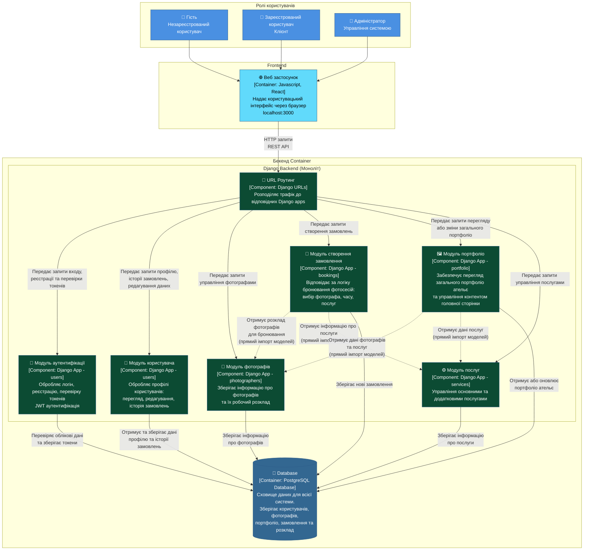

# Діаграма архітектури проекту фотостудії

## 📊 Візуальна діаграма (Mermaid)



---

## 📋 Текстовий опис діаграми

### 1. Ролі користувачів (Top Section)

**👤 Гість** (Guest)
- Незареєстрований користувач
- Може переглядати портфоліо, послуги, фотографів
- Може створювати бронювання як гість

**👤 Зареєстрований користувач** (Registered User)
- Клієнт з обліковим записом
- Доступ до особистого кабінету
- Перегляд та редагування своїх замовлень
- Персональна знижка

**👤 Адміністратор** (Administrator)
- Повний доступ до системи
- Управління фотографами, послугами, портфоліо
- Управління замовленнями
- Налаштування контенту головної сторінки

**Взаємодія:** Всі ролі взаємодіють з веб-застосунком через браузер.

---

### 2. Веб застосунок (Frontend)

**🌐 Веб застосунок**
- **Технологія:** JavaScript, React
- **Функціональність:** Надає користувацький інтерфейс через браузер
- **Порт:** localhost:3000
- **Особливості:**
  - React Router для навігації
  - Axios для HTTP запитів
  - JWT токени для аутентифікації
  - Bootstrap для стилізації

**Взаємодія:** Всі HTTP запити йдуть через REST API до бекенду.

---

### 3. Бекенд Container

#### 3.1. URL Роутинг (API Gateway аналог)

**🔀 URL Роутинг**
- **Технологія:** Django URLs
- **Функціональність:** Розподіляє трафік до відповідних Django apps
- **Особливості:**
  - Централізований роутинг в `studio/urls.py`
  - Маршрутизація API endpoints
  - Обробка статичних файлів та медіа

**Взаємодія:** 
- Отримує запити від Frontend
- Розподіляє до відповідних модулів

---

#### 3.2. Модуль аутентифікації

**🔐 Модуль аутентифікації**
- **Технологія:** Django App - users
- **Функціональність:** 
  - Обробляє логін, реєстрацію
  - Перевірка паролів
  - Генерація та валідація JWT токенів
- **Endpoints:**
  - `/api/token/` - отримання токену
  - `/api/token/refresh/` - оновлення токену
  - `/api/register/` - реєстрація

**Взаємодія:**
- Перевіряє облікові дані в Database
- Зберігає інформацію про токени

---

#### 3.3. Модуль користувача

**👤 Модуль користувача**
- **Технологія:** Django App - users
- **Функціональність:**
  - Обробляє профілі користувачів
  - Перегляд та редагування даних
  - Доступ до історії замовлень
  - Управління персональною знижкою
- **Endpoints:**
  - `/api/auth/users/myprofile/` - профіль користувача

**Взаємодія:**
- Отримує та зберігає дані профілю в Database
- Отримує історію замовлень з BookingModule

---

#### 3.4. Модуль фотографів

**📸 Модуль фотографів**
- **Технологія:** Django App - photographers
- **Функціональність:**
  - Зберігає інформацію про фотографів
  - Управління робочим розкладом
  - Зв'язок фотографів з послугами
- **Endpoints:**
  - `/api/photographers/` - список фотографів
  - `/api/photographers/{id}/` - деталі фотографа
  - `/api/photographers/me/` - профіль фотографа

**Взаємодія:**
- Зберігає інформацію про фотографів в Database
- Надає розклад для BookingModule (прямий імпорт)

---

#### 3.5. Модуль створення замовлення

**📅 Модуль створення замовлення**
- **Технологія:** Django App - bookings
- **Функціональність:**
  - Відповідає за логіку бронювання фотосесій
  - Вибір фотографа, часу, послуг
  - Розрахунок ціни з урахуванням знижок
  - Управління статусами замовлень
  - Завантаження результатів фотосесій
  - Відправка результатів на email
- **Endpoints:**
  - `/api/bookings/` - створення та список замовлень
  - `/api/bookings/my/` - мої замовлення
  - `/api/bookings/available_dates/` - доступні дати
  - `/api/bookings/available_slots/` - доступні часові слоти

**Взаємодія:**
- Прив'язує замовлення до користувача
- Отримує розклад фотографів (прямий імпорт з PhotographerModule)
- Отримує інформацію про послуги (прямий імпорт з ServiceModule)
- Зберігає нові замовлення в Database

---

#### 3.6. Модуль портфоліо

**🖼️ Модуль портфоліо**
- **Технологія:** Django App - portfolio
- **Функціональність:**
  - Забезпечує перегляд загального портфоліо ательє
  - Управління контентом головної сторінки
  - Фільтрація портфоліо за фотографом та послугою
- **Endpoints:**
  - `/api/portfolio/` - список портфоліо
  - `/api/portfolio/homepage-content/` - контент головної сторінки

**Взаємодія:**
- Отримує дані фотографів (прямий імпорт з PhotographerModule)
- Отримує дані послуг (прямий імпорт з ServiceModule)
- Отримує або оновлює портфоліо в Database

---

#### 3.7. Модуль послуг

**⚙️ Модуль послуг**
- **Технологія:** Django App - services
- **Функціональність:**
  - Управління основними послугами
  - Управління додатковими послугами
  - Ціни та описи послуг
- **Endpoints:**
  - `/api/services/` - список послуг
  - `/api/additional-services/` - додаткові послуги

**Взаємодія:**
- Зберігає інформацію про послуги в Database
- Надає дані для BookingModule та PortfolioModule

---

### 4. Database

**💾 Database**
- **Технологія:** PostgreSQL Database
- **Функціональність:**
  - Сховище даних для всієї системи
  - Зберігає користувачів, фотографів, портфоліо, замовлення та розклад
- **Таблиці:**
  - `users_user` - користувачі
  - `photographers_photographer` - фотографи
  - `services_service` - основні послуги
  - `services_additionalservice` - додаткові послуги
  - `bookings_booking` - замовлення
  - `portfolio_portfolio` - портфоліо
  - `portfolio_homepagecontent` - контент головної сторінки

**Взаємодія:**
- Всі модулі зберігають та отримують дані з Database

---

## 🔄 Особливості архітектури

### Монолітна архітектура

**Всі модулі працюють в одному процесі Django:**
- Не окремі сервіси, а Django apps (модулі)
- Прямі імпорти між модулями (не HTTP)
- Швидка комунікація (немає мережевих затримок)
- Простіше розробка та тестування

### Комунікація між модулями

**Прямі імпорти (не HTTP):**
```python
# bookings/views.py
from photographers.models import Photographer  # Прямий імпорт
from services.models import Service
```

**Переваги:**
- Швидше (немає мережевих затримок)
- Простіше (не потрібна серіалізація)
- Транзакції БД працюють коректно

---

## 📝 Легенда

- **Солідні стрілки (→):** HTTP запити / Зв'язки з БД
- **Пунктирні стрілки (-.->):** Прямі імпорти між модулями (в межах одного процесу)
- **Кольори:**
  - Синій: Ролі користувачів
  - Світло-синій: Frontend
  - Зелений: Backend модулі
  - Темно-синій: Database

---

## 🎯 Висновок

Діаграма відображає **монолітну архітектуру** з модульним підходом:
- Чітке розділення відповідальності (Django apps)
- Централізований роутинг (як API Gateway)
- Пряма комунікація між модулями (швидко та ефективно)
- Одна база даних для всієї системи

**Це оптимальна архітектура для проекту фотостудії!** ✅

